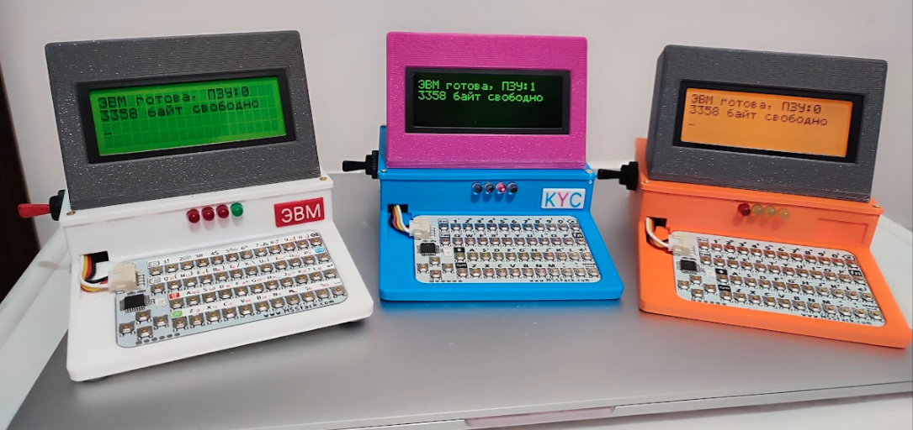
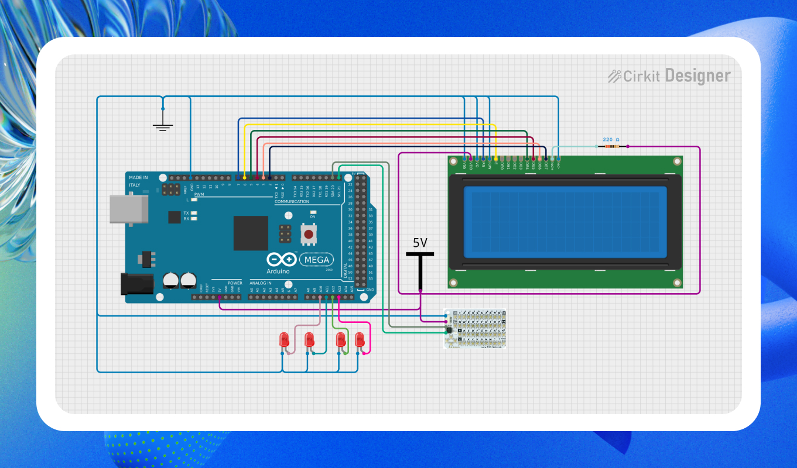

# Arduino-Computer

**Arduino-Computer** — компактное программируемое устройство на базе Arduino Mega 2560, представляющее собой полноценный микрокомпьютер в миниатюре. Устройство оснащено LCD-дисплеем 20×4, клавиатурой M5Stack CardKB и внешней EEPROM-памятью объёмом 32 КБ для хранения программ и данных. Встроенный интерпретатор языка BASIC, позволяет писать, редактировать и запускать программы прямо на устройстве без подключения к компьютеру.

Ключевые особенности проекта: автономная работа без ПК — полный цикл от написания до выполнения программы происходит на самом устройстве; поддержка русского языка с переключением раскладки; файловая система с каталогом до 20 файлов в EEPROM; встроенный текстовый редактор с прокруткой и навигацией; управление GPIO и аналоговыми входами напрямую из BASIC-программ; музыкальный плеер и просмотр ASCII-таблицы. Программы хранятся в текстовом формате с автоматической нумерацией строк при загрузке, что обеспечивает удобство редактирования и переносимость.



Статья по созданию данного компьютера: [Habr](https://habr.com/ru/companies/ozonbank/articles/1001396/)


## Оглавление

1. [Аппаратная часть](#аппаратная-часть)
2. [Лаунчер](#лаунчер)
3. [Специальные функции](#специальные-функции)
4. [Текстовый редактор](#текстовый-редактор)
5. [Русификация](#русификация)
6. [Язык BASIC](#язык-basic)
   - [Обзор](#обзор)
   - [Операторы](#операторы)
   - [Функции](#функции)
   - [Математические операторы](#математические-операторы)
   - [Операторы сравнения](#операторы-сравнения)
   - [Логические операторы](#логические-операторы)
7. [Работа с EEPROM](#работа-с-eeprom)
8. [GPIO и аналоговые входы](#gpio-и-аналоговые-входы)

---

## Аппаратная часть

| Компонент | Описание |
|-----------|----------|
| **Микроконтроллер** | Arduino Mega 2560 (ATmega2560, 16 МГц, 8 КБ RAM) |
| **LCD-дисплей** | 20×4 символа, HD44780-совместимый (пины 2–7) |
| **Клавиатура** | M5Stack CardKB (I2C, адрес 0x5F) |
| **Внешняя память** | AT24C256 EEPROM (I2C, адрес 0x50, 32 КБ) |
| **Буззер** | Подключён к пину 8 |
| **LED-индикатор** | Пин 10 (мигает при операциях с EEPROM) |


---

## Лаунчер

Лаунчер запускается автоматически при включении устройства. Отображает список сохранённых программ и специальные функции.

### Управление

| Клавиша | Действие |
|---------|----------|
| `1` | Создать новый файл (NEW) |
| `2` | Редактировать выбранную программу (EDIT) |
| `3` | Удалить выбранную программу (DELETE) |
| `4` / `Enter` | Запустить выбранную программу (RUN) |
| `↑` / `↓` | Навигация по списку |
| `ESC` | Выход из лаунчера |

---

## Специальные функции

В конце списка программ всегда отображаются три специальных пункта:

| Пункт | Описание |
|-------|----------|
| **[FORMAT]** | Форматирование EEPROM. Запрашивает подтверждение (`Y`). Удаляет все файлы. |
| **[ASCII]** | Отображение таблицы ASCII-символов устройства (коды 32–255). |
| **[MUSIC]** | Музыкальный плеер для воспроизведения мелодий из EEPROM. |

---

## Текстовый редактор

Встроенный редактор для создания и редактирования программ.

### Управление

| Клавиша | Действие |
|---------|----------|
| Стрелки `↑↓←→` | Перемещение курсора |
| `Enter` | Вставка новой строки |
| `Backspace` / `Del` | Удаление символа |
| `FN+F` (код 175) | Переключение раскладки EN/РУ |
| `FN+S` (код 174) | Сохранение файла |
| `ESC` | Выход (с предложением сохранить изменения) |

В нижней строке отображается имя файла, индикатор изменений (`*`) и позиция курсора (`строка:колонка`).

---

## Русификация

Устройство поддерживает ввод русского языка через переключение раскладки.

### Переключение раскладки

Нажмите `FN+F` (код 175) в редакторе или в режиме ввода BASIC. В правом верхнем углу на 1 секунду появится индикатор текущей раскладки:

- `EN` — английская раскладка
- `РУ` — русская раскладка (отображается пользовательскими символами LCD)

### Соответствие клавиш (англ → рус)

| EN | q | w | e | r | t | y | u | i | o | p | a | s | d | f | g |
|----|---|---|---|---|---|---|---|---|---|---|---|---|---|---|---|
| РУ | й | ц | у | к | е | н | г | ш | щ | з | ф | ы | в | а | п |

| EN | h | j | k | l | z | x | c | v | b | n | m | , | . |
|----|---|---|---|---|---|---|---|---|---|---|---|---|---|
| РУ | р | о | л | д | я | ч | с | м | и | т | ь | б | ю |

Цифры `7` `8` `9` `0` в русской раскладке маппятся на `х` `ж` `э` `ъ`.

---

## Язык BASIC

Диалект BASIC, основанный на Sinclair BASIC (ZX81/ZX Spectrum). Все числа internally представлены как float.

### Обзор

- **Номера строк** — при загрузке из EEPROM присваиваются автоматически (1, 2, 3, …)
- **Имена переменных** — до 16 символов, допускается `_` и `$` (для строк)
- **Массивы** — любой размерности, объявляются через `DIM`
- **Несколько команд на строке** — разделяются через `:`

### Операторы

| Оператор | Синтаксис | Описание |
|----------|-----------|----------|
| `PRINT` | `PRINT "текст"; x` | Вывод на экран. `;` — без пробела, `,` — с пробелом |
| `LET` | `LET a = 5` | Присваивание (необязательно: `a = 5`) |
| `INPUT` | `INPUT a` | Ввод значения с клавиатуры |
| `IF ... THEN` | `IF a > 5 THEN PRINT "ok"` | Условный переход |
| `GOTO` | `GOTO 10` | Безусловный переход к строке |
| `GOSUB` | `GOSUB 100` | Вызов подпрограммы |
| `RETURN` | `RETURN` | Возврат из подпрограммы |
| `FOR ... TO` | `FOR i = 1 TO 10` | Цикл |
| `STEP` | `FOR i = 1 TO 10 STEP 2` | Шаг цикла |
| `NEXT` | `NEXT i` | Следующая итерация цикла |
| `REM` | `REM комментарий` | Комментарий |
| `STOP` | `STOP` | Остановка программы |
| `CONT` | `CONT` | Продолжение после `STOP` |
| `CLS` | `CLS` | Очистка экрана |
| `PAUSE` | `PAUSE 1000` | Задержка в миллисекундах |
| `POSITION` | `POSITION x, y` | Установка позиции курсора |
| `DIM` | `DIM a(10)` / `DIM a$(5, 5)` | Объявление массива |
| `DATA` | `DATA 1, 2, 3` | Объявление данных |
| `READ` | `READ a` | Чтение данных |
| `RESTORE` | `RESTORE` | Сброс указателя `DATA` |

### Функции

| Функция | Синтаксис | Описание |
|---------|-----------|----------|
| `LEN()` | `LEN(a$)` | Длина строки |
| `VAL()` | `VAL("123")` | Преобразование строки в число |
| `STR$()` | `STR$(x)` | Преобразование числа в строку |
| `INT()` | `INT(3.7)` | Целая часть числа (floor) |
| `RND` | `RND` | Случайное число [0, 1) |
| `ABS()` | `ABS(-5)` | Модуль числа |
| `SIN()` | `SIN(x)` | Синус |
| `COS()` | `COS(x)` | Косинус |
| `LEFT$()` | `LEFT$("abc", 2)` | Левые символы строки |
| `RIGHT$()` | `RIGHT$("abc", 2)` | Правые символы строки |
| `MID$()` | `MID$("abc", 1, 2)` | Подстрока |
| `CHR$()` | `CHR$(65)` | Символ по коду |
| `INKEY$` | `a$ = INKEY$` | Последняя нажатая клавиша |
| `PINREAD()` | `PINREAD(13)` | Чтение цифрового пина |
| `ANALOGRD()` | `ANALOGRD(0)` | Чтение аналогового пина |

### Математические операторы

| Оператор | Описание |
|----------|----------|
| `+` | Сложение / конкатенация строк |
| `-` | Вычитание |
| `*` | Умножение |
| `/` | Деление |
| `MOD` | Остаток от деления (целые числа) |

### Операторы сравнения

| Оператор | Описание |
|----------|----------|
| `=` | Равно |
| `<>` | Не равно |
| `<` | Меньше |
| `>` | Больше |
| `<=` | Меньше или равно |
| `>=` | Больше или равно |

### Логические операторы

| Оператор | Описание |
|----------|----------|
| `AND` | Логическое И |
| `OR` | Логическое ИЛИ |
| `NOT` | Логическое НЕ |

### Специальные команды

| Команда | Описание |
|---------|----------|
| `BEEP` | Звуковой сигнал (буззер на пине 8, нота C5, 200мс) |
| `TEST_PRINT` | Вывод `WORKING` в Serial (для отладки) |
| `PLAY <файл>` | Воспроизведение мелодии из файла |


### Управляющие команды

Данный список команд доступен только из терминального режима, который отключен в пользу файлового менеджера.

| Команда         | Синтаксис       | Описание                                         |
|-----------------|-----------------|--------------------------------------------------|
| `SAVE "имя"`    |                 | Сохранение программы в EEPROM (текстовый формат) |
| `SAVE+`         |                 | Сохранение + установка автозагрузки              |
| `LOAD "имя"`    |                 | Загрузка программы из EEPROM                     |
| `DIR`           |                 | Список файлов в EEPROM                           |
| `DELETE "имя"`  |                 | Удаление файла из EEPROM |
| `FORMAT`        |                 | Форматирование EEPROM |
| `NEW`           | `NEW`           | Очистка программы из памяти                      |
| `RUN`           | `RUN [строка]`  | Запуск программы (опционально с номера строки)   |
| `LIST`          | `LIST [от, до]` | Вывод программы на экран                         |

---

## Работа с EEPROM

### Структура памяти

| Область | Адреса | Размер |
|---------|--------|--------|
| Каталог | 0–511 | 512 байт (до 20 файлов) |
| Данные файлов | 512–32767 | ~32 КБ |

### Запись программ

Программы сохраняются в **текстовом формате** (не токенизированном). При загрузке строки автоматически получают номера (1, 2, 3, …) и токенизируются.

---

## GPIO и аналоговые входы

### Команды

| Команда | Описание |
|---------|----------|
| `PINMODE пин, режим` | Установка режима: 0 = INPUT, 1 = OUTPUT, 2 = INPUT_PULLUP |
| `PIN пин, состояние` | Запись: 0 = LOW, non-zero = HIGH |
| `PINREAD(пин)` | Чтение цифрового пина (0 или 1) |
| `ANALOGRD(пин)` | Чтение аналогового пина (0–1023) |

### Примеры

```basic
10 PINMODE 13, 1
20 PIN 13, 1
30 PAUSE 500
40 PIN 13, 0
50 x = PINREAD(2)
60 y = ANALOGRD(0)
70 PRINT x, y
```

---

## Горячие клавиши (глобальные)

Доступны в режиме ввода (BASIC `INPUT`, редактор):

| Код | Действие |
|-----|----------|
| 175 (`FN+F`) | Переключение раскладки EN/РУ |
| 129 | Показать ASCII-таблицу |
| 130 | Запустить музыкальный плеер |
| 131 | Загрузка программы через Serial |

---

## Технические характеристики

| Параметр | Значение |
|----------|----------|
| Максимальный размер программы | ~32 КБ (EEPROM) |
| RAM для переменных | 1024 байта |
| Макс. длина имени переменной | 16 символов |
| Макс. количество файлов | 20 |
| Частота I2C | 100 кГц |
| Скорость Serial | 9600 бод |
